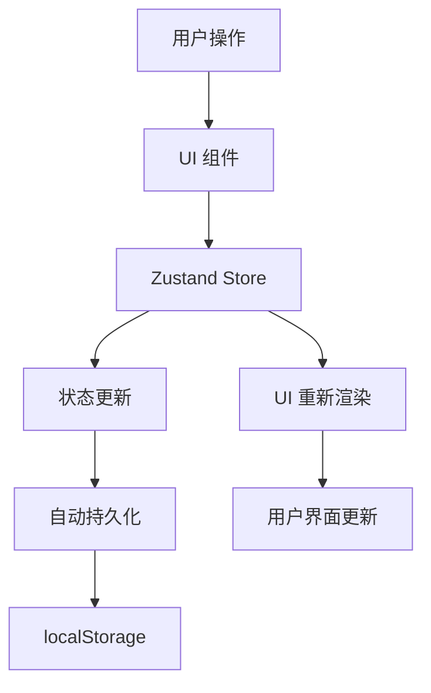
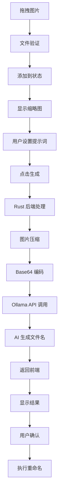
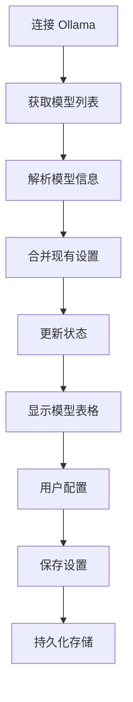

# ImageSaid 技术架构文档

## 🏗️ 整体架构

ImageSaid 采用现代化的桌面应用架构，基于 Tauri 框架构建，实现了前后端分离的设计模式。

```
┌─────────────────────────────────────────────────────────────┐
│                    ImageSaid 应用架构                        │
├─────────────────────────────────────────────────────────────┤
│  前端 (React + TypeScript)    │    后端 (Rust + Tauri)      │
│  ┌─────────────────────────┐  │  ┌─────────────────────────┐ │
│  │    用户界面层 (UI)       │  │  │     系统接口层          │ │
│  │  • NavigationBar        │  │  │  • 文件系统操作         │ │
│  │  • ImageList           │  │  │  • 网络请求处理         │ │
│  │  • PromptEditor        │  │  │  • 图片处理             │ │
│  │  • StatusBar           │  │  │  • 重命名操作           │ │
│  └─────────────────────────┘  │  └─────────────────────────┘ │
│  ┌─────────────────────────┐  │  ┌─────────────────────────┐ │
│  │    状态管理层            │  │  │     AI 集成层           │ │
│  │  • Zustand Store        │  │  │  • Ollama API 调用      │ │
│  │  • 数据持久化           │  │  │  • 图片压缩处理         │ │
│  │  • 状态同步             │  │  │  • 模型管理             │ │
│  └─────────────────────────┘  │  └─────────────────────────┘ │
│  ┌─────────────────────────┐  │  ┌─────────────────────────┐ │
│  │    业务逻辑层            │  │  │     安全层              │ │
│  │  • 图片管理             │  │  │  • 权限控制             │ │
│  │  • 模板管理             │  │  │  • 数据验证             │ │
│  │  • 配置管理             │  │  │  • 错误处理             │ │
│  └─────────────────────────┘  │  └─────────────────────────┘ │
└─────────────────────────────────────────────────────────────┘
                              │
                    ┌─────────────────┐
                    │   Ollama 服务   │
                    │  • 本地 AI 模型  │
                    │  • Vision LLM   │
                    │  • API 接口     │
                    └─────────────────┘
```

## 📁 项目结构

```
ImageSaid/
├── src/                          # 前端源码
│   ├── components/               # React 组件
│   │   ├── NavigationBar.tsx     # 导航栏组件
│   │   ├── ImageList.tsx         # 图片列表组件
│   │   ├── ImageRow.tsx          # 图片行组件
│   │   ├── PromptEditor.tsx      # 提示词编辑器
│   │   ├── StatusBar.tsx         # 状态栏组件
│   │   └── dialogs/              # 对话框组件
│   │       ├── OllamaSettingsDialog.tsx    # Ollama设置对话框
│   │       └── PromptManagementDialog.tsx  # 提示词管理对话框
│   ├── store/                    # 状态管理
│   │   └── useAppStore.ts        # Zustand 全局状态
│   ├── App.tsx                   # 主应用组件
│   ├── main.tsx                  # 应用入口
│   └── vite-env.d.ts             # Vite 类型定义
├── src-tauri/                    # 后端源码
│   ├── src/
│   │   └── main.rs               # Rust 主程序
│   ├── Cargo.toml                # Rust 依赖配置
│   ├── tauri.conf.json           # Tauri 应用配置
│   └── capabilities/             # 权限配置
│       └── default.json          # 默认权限
├── public/                       # 静态资源
├── package.json                  # Node.js 依赖配置
├── vite.config.ts                # Vite 构建配置
├── tsconfig.json                 # TypeScript 配置
└── README.md                     # 项目文档
```

## 🔧 技术栈详解

### 前端技术栈

#### React 18 + TypeScript
- **用途**: 构建用户界面和业务逻辑
- **优势**: 
  - 类型安全，减少运行时错误
  - 组件化开发，代码复用性高
  - 虚拟 DOM，性能优化

#### Material-UI (MUI) v5
- **用途**: UI 组件库
- **特性**:
  - 现代化设计语言
  - 丰富的组件库
  - 主题定制能力
  - 响应式设计

#### Zustand
- **用途**: 状态管理
- **优势**:
  - 轻量级，无样板代码
  - TypeScript 友好
  - 简单易用的 API
  - 自动状态持久化

#### Vite
- **用途**: 构建工具
- **特性**:
  - 快速的开发服务器
  - 热模块替换 (HMR)
  - 优化的生产构建
  - 插件生态系统

### 后端技术栈

#### Rust
- **用途**: 系统级编程和性能关键部分
- **优势**:
  - 内存安全，无数据竞争
  - 高性能，接近 C/C++
  - 零成本抽象
  - 丰富的生态系统

#### Tauri
- **用途**: 跨平台桌面应用框架
- **特性**:
  - 基于 Web 技术构建
  - 原生性能
  - 安全性优先
  - 小体积应用

#### reqwest
- **用途**: HTTP 客户端
- **功能**:
  - 异步 HTTP 请求
  - JSON 序列化/反序列化
  - 错误处理
  - 连接池管理

#### image
- **用途**: 图片处理
- **功能**:
  - 多种图片格式支持
  - 图片压缩和调整
  - 格式转换
  - 元数据处理

## 🔄 数据流架构

### 状态管理流程



### 图片处理流程



### 模型管理流程



## 🔐 安全架构

### 权限控制
- **文件系统访问**: 通过 Tauri 权限系统控制
- **网络访问**: 限制为 Ollama API 调用
- **本地存储**: 使用安全的 localStorage

### 数据安全
- **本地处理**: 所有图片处理在本地完成
- **无云端传输**: 图片不会上传到任何服务器
- **隐私保护**: 用户数据完全本地化

### 错误处理
- **输入验证**: 前端和后端双重验证
- **异常捕获**: 完善的错误处理机制
- **用户反馈**: 清晰的错误提示信息

## 🚀 性能优化

### 前端优化
- **虚拟滚动**: 大量图片时的性能优化
- **懒加载**: 图片缩略图按需加载
- **状态缓存**: 避免不必要的重新渲染
- **代码分割**: 按需加载组件

### 后端优化
- **异步处理**: 非阻塞的 I/O 操作
- **内存管理**: 高效的图片处理
- **并发控制**: 合理的资源使用
- **缓存策略**: 减少重复计算

### 图片处理优化
- **智能压缩**: 根据模型能力调整图片大小
- **格式优化**: 选择合适的图片格式
- **批量处理**: 高效的批量操作
- **进度反馈**: 实时处理状态更新

## 🔧 配置管理

### 应用配置
```json
{
  "apiUrl": "http://localhost:11434",
  "model": "qwen2.5vl:3b-32k",
  "connectionState": "success",
  "availableModels": [...],
  "modelsLoading": false
}
```

### 用户设置
```json
{
  "config": {...},
  "prompt": "请用简洁的中文描述图片内容...",
  "promptTemplates": [...],
  "currentTemplateId": "default"
}
```

### 权限配置
```json
{
  "dialog": {
    "allow-open": true,
    "default": true
  },
  "fs": {
    "scope": ["$APPDATA", "$APPDATA/*"]
  }
}
```

## 🧪 测试策略

### 单元测试
- **前端组件**: React Testing Library
- **状态管理**: Zustand 状态测试
- **工具函数**: Jest 测试框架

### 集成测试
- **API 集成**: Ollama 连接测试
- **文件操作**: 重命名功能测试
- **用户流程**: 端到端测试

### 性能测试
- **内存使用**: 大量图片处理测试
- **响应时间**: UI 交互性能测试
- **并发处理**: 多任务处理测试

## 🔄 部署架构

### 开发环境
- **热重载**: 开发时实时更新
- **调试工具**: 完整的调试支持
- **错误报告**: 详细的错误信息

### 生产环境
- **代码压缩**: 优化包大小
- **资源优化**: 静态资源优化
- **错误监控**: 生产环境错误收集

### 分发策略
- **多平台支持**: Windows, macOS, Linux
- **自动更新**: 版本更新机制
- **安装程序**: 用户友好的安装体验

## 📈 扩展性设计

### 模块化架构
- **组件化**: 可复用的 UI 组件
- **插件化**: 可扩展的功能模块
- **配置化**: 灵活的配置系统

### 未来扩展
- **多语言支持**: 国际化支持
- **主题系统**: 自定义主题
- **插件系统**: 第三方插件支持
- **云端同步**: 设置云端备份

---

*本文档描述了 ImageSaid 的完整技术架构，为开发和维护提供指导。*